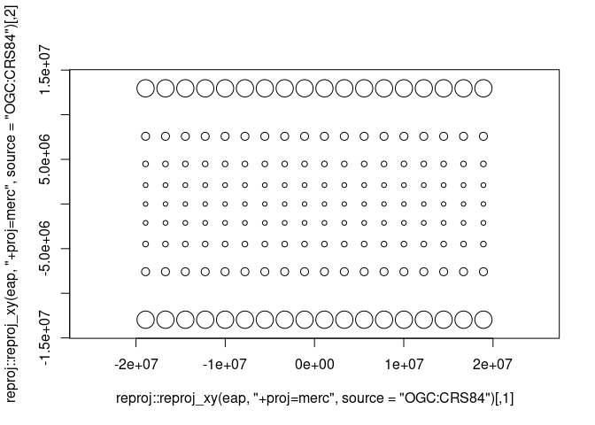
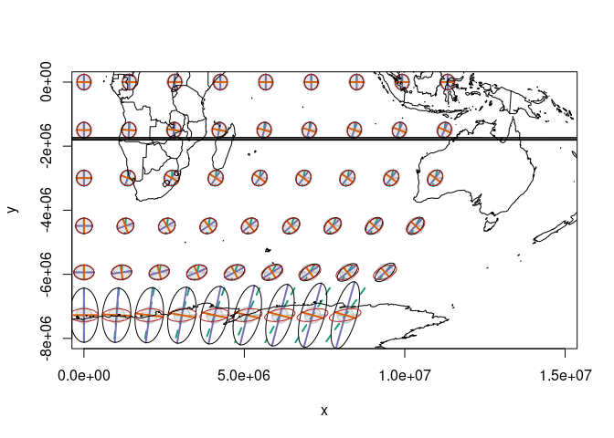

<!-- README.md is generated from README.Rmd. Please edit that file -->

# earthcircle

<!-- badges: start -->
<!-- badges: end -->

The goal of earthcircle is to …

## Installation

You can install the development version of earthcircle from
[Github](https://github.com/hypertidy/earthcircle) with:

``` r
pak::pak("hypertidy/earthcircle")
```

## Example

This is a basic example which shows you how to solve a common problem:

``` r
library(earthcircle)
pts <- expand.grid(seq(-170, 170 ,length.out = 18), seq(-75, 75, length.out = 9))
eap <- earthcircle(pts, scale = 500500)
plot(reproj::reproj_xy(eap, "+proj=merc", source = "OGC:CRS84"), type = "l", asp = 1)
```



Minimal compare of the tissot ellipses with earth circle (most online
stuff confuses these).

``` r
pts <- expand.grid(seq(0, 120 ,length.out = 9), seq(-70, 0, length.out = 6))
eap <- earthcircle(pts, scale = 500500)
library(tissot)
ti <- tissot(pts, proj.out = "+proj=robin", proj.in = "+proj=longlat")

ii <- indicatrix(ti, scale = 500500/2)
plot(ii, xlim = c(5e6, 1e7), ylim = c(-8e6, 0), asp = 1)
lines(earthcircle:::.prj(eap, "+proj=robin"), col ="firebrick")

m <- reproj::reproj_xy(do.call(cbind, maps::map(plot = F)[1:2]), "+proj=robin", source = "OGC:CRS84")
lines(m)
```


